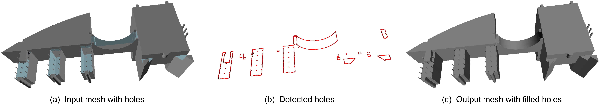

# Automatic-Repair-of-LoD2-Building-Models

This repository provides the implementation for the automatic repair of LoD2 building models. It is primarily developed using C++ and leverages open-source libraries such as [CGAL](https://www.cgal.org/) and [Easy3D](https://github.com/LiangliangNan/Easy3D).

Our paper, [Filling holes in LoD2 building models](https://isprs-annals.copernicus.org/articles/X-4-W5-2024/171/2024/), has been accepted for presentation at the 3D Geoinfo 2024 conference. 
We are currently releasing the core module of our code, which focuses on mesh hole filling, along with the corresponding executable. 
We are also preparing an extended journal paper that will address three types of errors in building models: mesh geometric holes, incorrect normal orientations, and inner faces. 
The complete source code will be made available following the acceptance of our full paper.
<div align="center">
    <figure>
        
        <figcaption>Pipeline for filling holes in LoD2 building models.</figcaption>
    </figure>
</div>

## Usage
The program has currently only been tested on Windows, but we will also test it on Linux and release the corresponding executable files later. 
To run the file on Windows, please enter the following command:
```
.\building_pcc_data.exe [your_path]\config.txt
```
Details about the parameters can be found in the `config.txt` file.


## Citation
If you find our work useful in your research, please consider citing: 
```
@Article{isprs-annals-X-4-W5-2024-171-2024,
AUTHOR = {Gao, W. and Peters, R. and Ledoux, H. and Stoter, J.},
TITLE = {Filling holes in LoD2 building models},
JOURNAL = {ISPRS Annals of the Photogrammetry, Remote Sensing and Spatial Information Sciences},
VOLUME = {X-4/W5-2024},
YEAR = {2024},
PAGES = {171--177},
URL = {https://isprs-annals.copernicus.org/articles/X-4-W5-2024/171/2024/},
DOI = {10.5194/isprs-annals-X-4-W5-2024-171-2024}
}
```

## License
This implementation is free software; you can redistribute it and/or modify it under the terms of the 
GNU General Public License as published by the Free Software Foundation; either version 3
of the License or (at your option) any later version. The full text of the license can be
found in the accompanying 'License' file.

If you have any questions, comments, or suggestions, please contact me at <i>gaoweixiaocuhk@gmail.com</i>

[<b><i>Weixiao GAO</i></b>](https://3d.bk.tudelft.nl/weixiao/)

May. 1st, 2024
